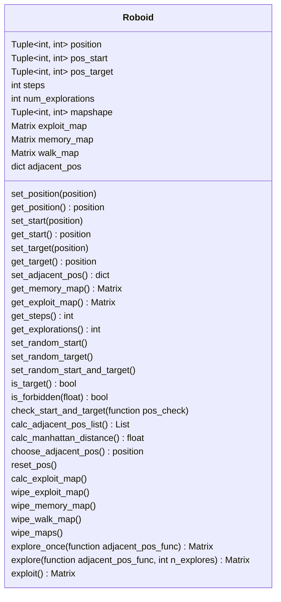

# Model diagram

```mermaid
classDiagram
    class Roboid{
        Tuple~int, int~ position
        Tuple~int, int~ pos_start
        Tuple~int, int~ pos_target
        int steps
        int num_explorations
        Tuple~int, int~ mapshape
        Matrix exploit_map
        Matrix memory_map
        Matrix walk_map
        dict adjacent_pos

        set_position(position)
        get_position() position
        set_start(position)
        get_start() position
        set_target(position)
        get_target() position
        set_adjacent_pos() dict
        get_memory_map() Matrix
        get_exploit_map() Matrix
        get_steps() int
        get_explorations() int
        set_random_start()
        set_random_target()
        set_random_start_and_target()

        is_target() bool
        is_forbidden(float) bool
        check_start_and_target(function pos_check)

        calc_adjacent_pos_list() List
        calc_manhattan_distance() float
        choose_adjacent_pos() position
        reset_pos()

        calc_exploit_map()
        wipe_exploit_map()
        wipe_memory_map()
        wipe_walk_map()
        wipe_maps()

        explore_once(function adjacent_pos_func) Matrix
        explore(function adjacent_pos_func, int n_explores) Matrix
        exploit() Matrix
    }
```
