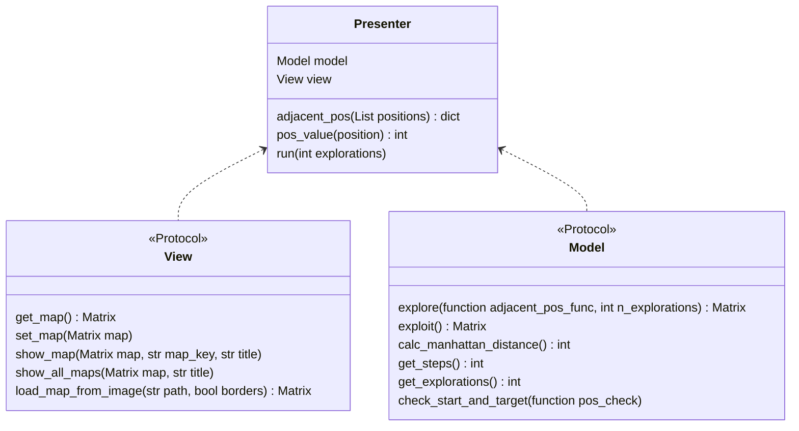

# Presenter diagram

```mermaid
classDiagram

    Presenter <.. View
    Presenter <.. Model

    class View {
        get_map() Matrix
        set_map(Matrix map)
        show_map(Matrix map, str map_key, str title)
        show_all_maps(Matrix map, str title)
        load_map_from_image(str path, bool borders) Matrix
    }
    <<Protocol>> View

    class Model {
        explore(function adjacent_pos_func, int n_explorations) Matrix
        exploit() Matrix
        calc_manhattan_distance() int
        get_steps() int
        get_explorations() int
        check_start_and_target(function pos_check)
    }
    <<Protocol>> Model

    class Presenter {
        Model model
        View view

        adjacent_pos(List positions) dict
        pos_value(position) int
        run(int explorations)
    }
```
