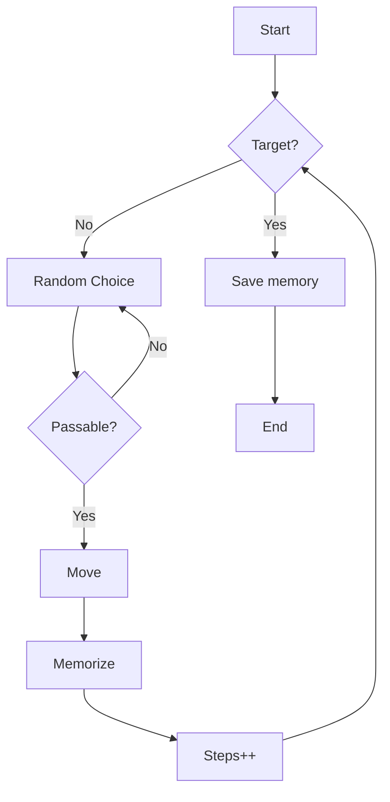

# Task

On a tiled map a 'roboid' starts at one position and has to find a target.
It only can turn in 90 degree angles and can only see the adjacent tiles.
The target is reached if the 'roboid' stands on top of it.
It has to find the optimal way to the target.

As a Bonus on lab.open-roberta.org NEPO a EV3 robot shall use this general
technique to find and move to a target.

## Roboid

The roboid should have two modes (or a mix of both):

- Exploration:
    In this mode the 'roboid' will travel with random choice from tile to
    tile and remember it's way and steps.

- Exploitation:
    In this mode the 'roboid' will use the during 'Exploration' gathered
    information to find the optimal way.
    The optimal way could be determined by a few metrics:
  - Least amount of steps to target
  - Least amount of energy needed
  - Minimal steps with minimal energy

Basic roboid functions should work together with the python api for EV3dev.
This will be solved over a protocol layer.

## Map

- The map has a rectangular shape with variable sides (integer).
- The map has closed borders, that means the roboid can't travel to the
  other side via stepping over the edge.
- The map could contain terrain information like:
  - height information
  - difficulty of terrain
    - light
    - normal
    - hard
    - impossible
- The map has a fixed or random starting and end point.
- The map has no memory and won't remember the roboids path.

## Bonus

The map is the simulation field and targets and terrain are colored squares.

### Useful notes

- The EV3dev robot uses Python as code generator.
- Fraunhofer institute infos [link](https://jira.iais.fraunhofer.de/wiki/display/ORInfo/Programming+EV3#ProgrammingEV3-ProgrammingLanguagesforCodeGeneration)
- Python API reference for EV3dev [link](https://ev3dev-lang.readthedocs.io/projects/python-ev3dev/en/stable/spec.html)
