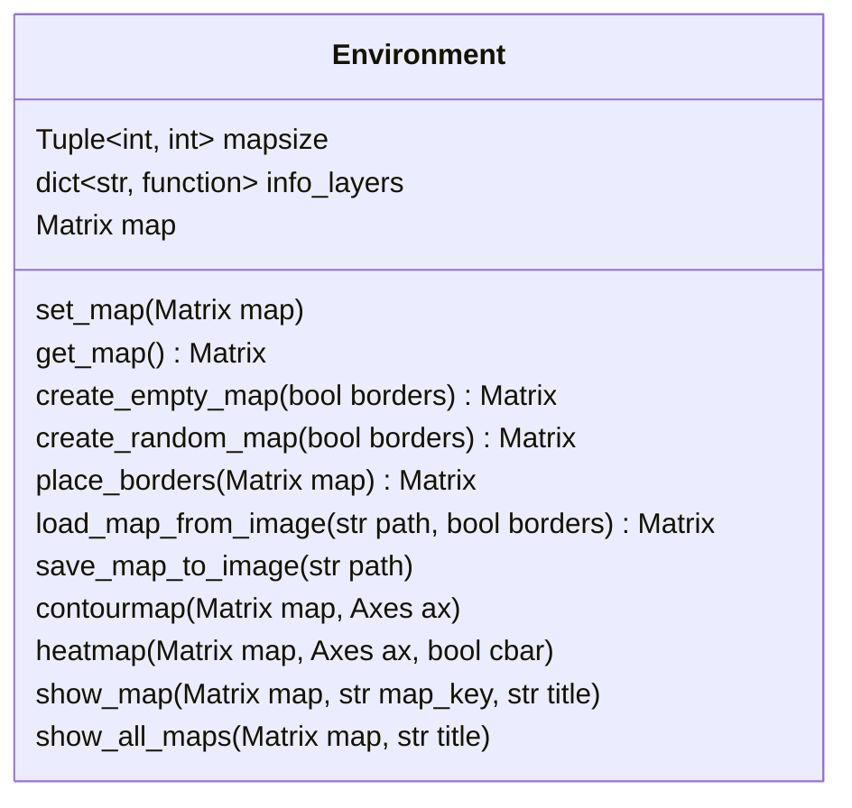

# View diagram

```mermaid
classDiagram
    class Environment{
        Tuple~int, int~ mapsize
        dict~str, function~ info_layers
        Matrix map

        set_map(Matrix map)
        get_map() Matrix

        create_empty_map(bool borders) Matrix
        create_random_map(bool borders) Matrix
        place_borders(Matrix map) Matrix
        load_map_from_image(str path, bool borders) Matrix
        save_map_to_image(str path)

        contourmap(Matrix map, Axes ax)
        heatmap(Matrix map, Axes ax, bool cbar)

        show_map(Matrix map, str map_key, str title)
        show_all_maps(Matrix map, str title)
    }
```
